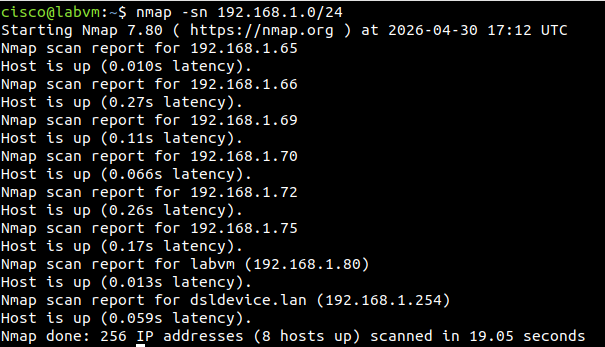
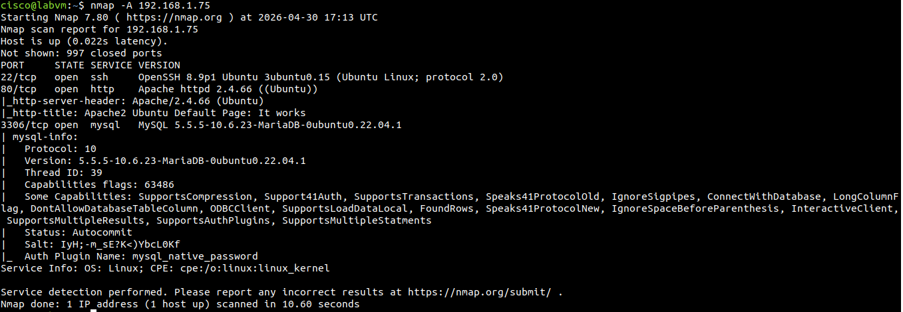
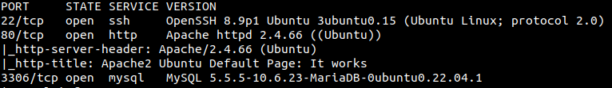

# 🔍 TP1 - Network Scan with Nmap

## 🎯 Objective
Discover active hosts, open ports, and services in a network.

## 🛠️ Tools
- Nmap
- Linux (LabVM)

## ⚙️ Commands Used
```bash
ip a
nmap -sn 192.168.x.0/24
nmap -sV -A IP

## 📌 Conclusion

This lab demonstrates the reconnaissance phase of cybersecurity.

## 📸 Evidence



