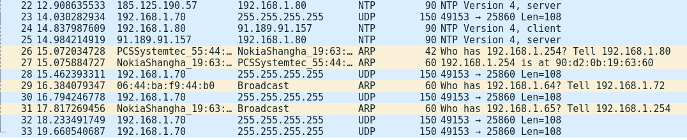
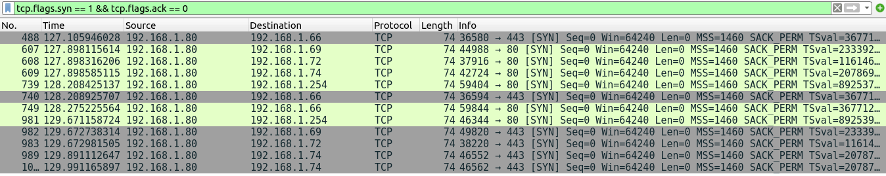
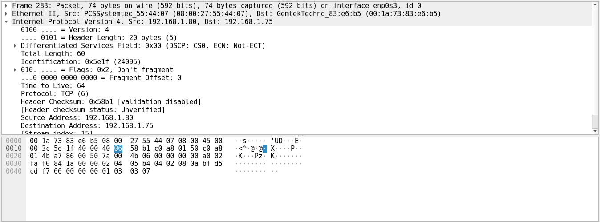

## 📄 TP2 — SOC Analysis (Wireshark)

```markdown
# 🛡️ TP2 - SOC Analysis with Wireshark

## 🎯 Objective
Capture and analyze network traffic to detect suspicious activity.

## 🛠️ Tools
- Wireshark
- Nmap

## ⚙️ Scenario
Simulated Nmap scan on a target machine.

## 🔍 Detection
- SYN packets detected
- Multiple ports scanned
- HTTP traffic observed

## 🚨 Suspicious Activity
- Network scanning behavior
- Repeated connection attempts

## 🧠 Analysis
Traffic analysis shows a reconnaissance attempt using Nmap.

## 📌 Conclusion
Wireshark can detect early-stage attacks like port scanning.

## 📸 Evidence



