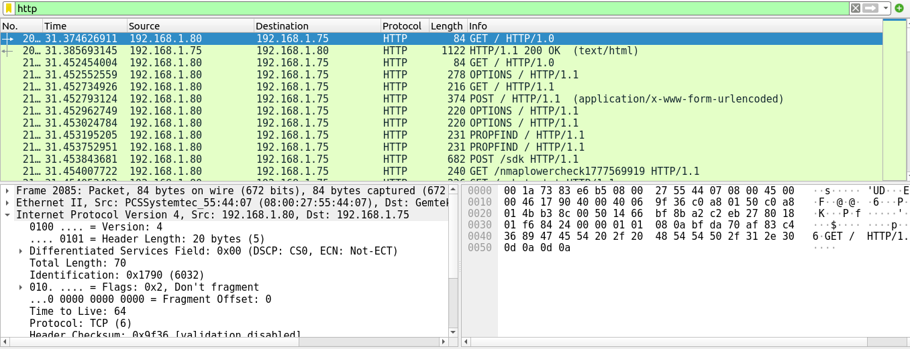
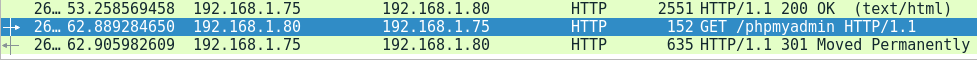
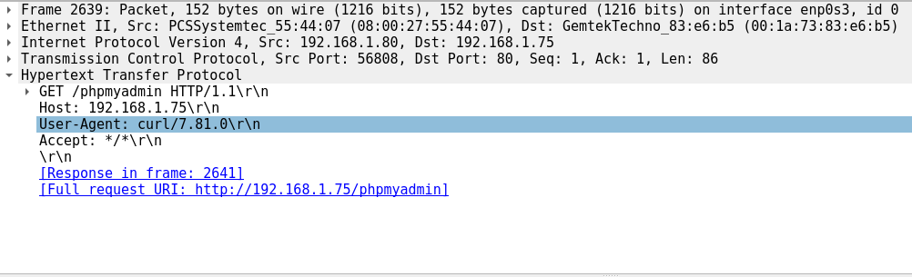
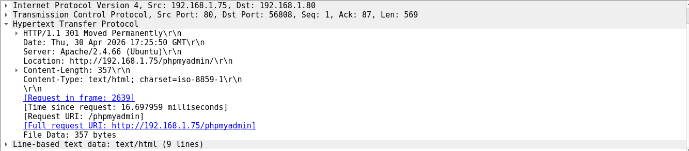

## 🚨 Incident Analysis - Web Intrusion Attempt

### 📍 Source
192.168.1.X

### 🎯 Target
192.168.1.Y

### 🔍 Activity Detected
- TCP SYN scan (multiple ports)
- HTTP enumeration (GET /, OPTIONS)
- Direct access attempt to /phpmyadmin

### 🧪 Evidence
- HTTP GET request to /phpmyadmin
- User-Agent: curl (automated tool)
- 301 redirect confirms service existence

### 🧠 Analysis
The attacker performed a full reconnaissance phase followed by targeted probing of a sensitive web application (phpMyAdmin).

### 🚨 Risk Level
HIGH

### ⚠️ Potential Impact
- Unauthorized database access
- Data exfiltration
- Service compromise

### ✅ Recommendations
- Restrict phpMyAdmin access (IP filtering)
- Disable remote MySQL access
- Monitor suspicious HTTP requests
- Deploy IDS/IPS

### 📌 Conclusion
This incident represents a typical multi-stage attack:
Reconnaissance → Service discovery → Targeted exploitation attempt

### 📸 Evidence

