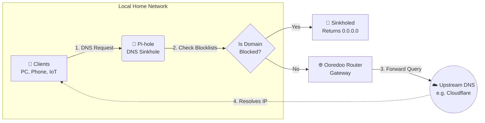

# Network-Wide Ad Blocking & Security Sinkhole

## Project Overview

This project involves the deployment of a **Pi-hole** server on a Raspberry Pi
to act as a private DNS sinkhole for a home network.

By centralizing DNS resolution, this implementation provides network-wide
protection against advertisements, trackers, and malicious domains,
enhancing both privacy and security for all connected devices
(PCs, smartphones, IoT, Smart TVs).

---

## 🏗️ Network Architecture & DNS Flow

By centralizing DNS resolution through the Pi-hole,
the network establishes a single inspection point.

This allows for efficient, network-wide filtering
of trackers, ads, and malicious domains before
they ever reach the end-user devices.

---

## 🛠️ Deployment Log

The deployment was performed on a Raspberry Pi running Raspberry Pi OS (Lite), accessed remotely via SSH.

### 1. System Preparation

Ensuring the operating system and package repositories were fully updated before installation to prevent dependency conflicts:

```bash
sudo apt update
sudo apt full-upgrade -y
sudo reboot
```

### 2. Pi-hole Installation

```bash
curl -sSL https://install.pi-hole.net | bash
```

### 3. Core Configuration Parameters

During the installation wizard, the following parameters were defined to integrate with the local Ooredoo router environment:

- **Network Interface:** `wlan0` (Wireless configuration)
- **Static IP Binding:** Enforced a static IP address to ensure stable, uninterrupted DNS resolution for all clients
- **Upstream DNS:** Configured a secure upstream DNS provider to handle non-blocked queries
- **Blocklists:** Enabled StevenBlack's Unified Hosts List by default to immediately mitigate known ad-serving and malware domains

### 4. Post-Installation Security

```bash
pihole -a -p
```

---

## 🛡️ Security Validation & Monitoring

To ensure the effectiveness of the Pi-hole deployment, several validation tests were performed to monitor traffic and confirm the blocking of malicious or unwanted domains.

### 1. Functional Testing (Ad-Block Verification)

Using specialized tools like AdBlock Tester, the network achieved a near 100% efficiency score, confirming that DNS requests for known ad servers are successfully intercepted and sinkholed.

### 2. Real-time Traffic Analysis

The Pi-hole Dashboard provides granular visibility into network-wide requests. This was used to identify:

- **Top Blocked Domains:** Analyzing which trackers (e.g., telemetry from smart devices) are most persistent
- **Client Behavior:** Monitoring which devices on the network are attempting to communicate with third-party tracking servers

### 3. Log Auditing via CLI

For deeper analysis, the `pihole.log` was audited to verify the handling of DNS queries in real time.

This command allows immediate threat detection:

```bash
pihole -t
```
### What this code will visually generate:

- A **"Local Home Network"** box grouping your devices and your Raspberry Pi.
- A **decision process** (the diamond shape): showing the exact inspection step (**choke point**) where Pi-hole determines whether a domain is safe or malicious/advertising-related.
- The **Internet outbound connection**: through your Ooredoo router to the final DNS provider.

